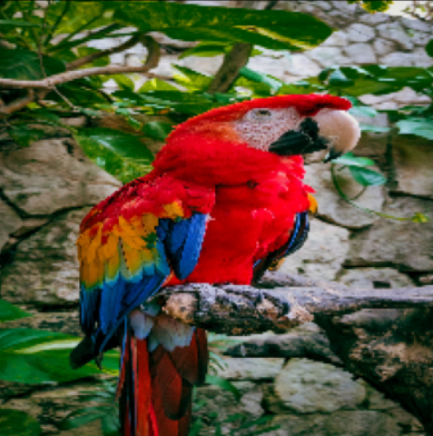
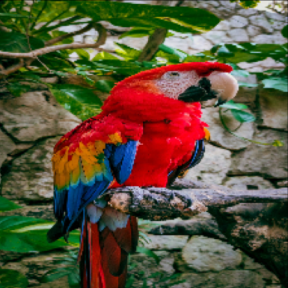

# Adversarial Examples
This project aims to reduce the precision of MobileNetV2 by conducting adversarial attacks. I have also written some notes about the [paper](https://arxiv.org/abs/1412.6572).

MobileNetV2 is a CNN model that can classify images into 1000 object categories. As we can see, the model classifies the macaw image with 94% confidence. By applying perturbation η, we can reduce this number to only 8%. Surprisingly, human eyes cannot distinguish between these two images.

|  |  |
|:--:|:--:|
| *Original image* | *Noisy image* |

# Refrences
- [Explaining and Harnessing Adversarial Examples](https://arxiv.org/abs/1412.6572) Ian J. Goodfellow, Jonathon Shlens, Christian Szegedy.
